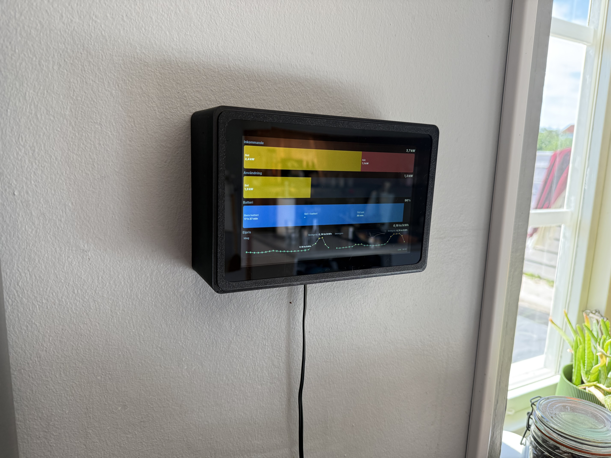

# Sigenergy + Tibber Wall Dashboard

A small PHP dashboard for a wall-mounted screen showing Sigenergy solar, grid, battery, export and electricity price status.



The dashboard is intentionally simple:

- PHP serves the page and API proxy endpoints.
- JavaScript renders the live dashboard.
- SCSS contains the visual layout and animations.
- `const.env` stores local credentials and settings outside the web root.

## Project Structure

```text
.
├── const-sample.env
├── dashboard.jpg
├── README.md
├── tools/
│   ├── sigen-check.php
│   ├── sigen-onboard.php
│   └── wiz-price-light.py
├── var/
│   └── runtime cache files
└── www/
    ├── index.php
    ├── css/style.css
    ├── js/dashboard.js
    ├── lang/en.json
    ├── lang/sv.json
    └── scss/
        ├── style.scss
        └── watch-sass.sh
```

`const.env` is created locally from `const-sample.env`. `var/` is created at runtime for cached tokens, the latest live snapshot and cached electricity prices. These local files should not be committed.

## Configuration

Copy `const-sample.env` to `const.env` in the project root. Do not put this file inside `www/`, leave it where it is.

### Sigenergy Auth

Set `SIGEN_AUTH_TYPE=password` to authenticate with Sigenergy account credentials. This has been the most useful mode during development.

Set `SIGEN_AUTH_TYPE=key` to use `SIGEN_APP_KEY` and `SIGEN_APP_SECRET` instead.

### Battery Settings

`SIGEN_BATTERY_CAPACITY_KWH` is used for runtime estimates.

`SIGEN_BATTERY_RESERVE_PERCENT` is subtracted from the battery percentage when calculating how long the battery can run the house. For example, if the battery is configured to keep 10% reserved, use:

```env
SIGEN_BATTERY_RESERVE_PERCENT=10
```

### Electricity Prices

If `TIBBER_API_KEY` is set, prices are fetched from Tibber. The code also accepts `TIBBER_TOKEN`, `TIBBER_ACCESS_TOKEN` and `TIBBER_API_TOKEN` for compatibility.

If `SNAP_SETTINGS_PATH` points to a Snap settings JSON file, the dashboard can read `tibber_api_key`, `home_index` and `price_breakpoints` from that file. Values in `const.env` take priority over the Snap settings file.

If no Tibber token is set, the dashboard falls back to public Swedish electricity prices. The fallback defaults to `SE3`; change it with:

```env
ELPRICE_AREA=SE4
```

The price breakpoints are used to color the graph points.

The footer can show the current month as:

```text
Consumption - Produced = Monthly cost
```

Tibber's public GraphQL API exposes historical consumption cost and production profit. It does not expose Grid Rewards or the app's complete monthly summary.

### Wiz Price Light

The optional Wiz integration reads the dashboard price cache and sets a Wiz bulb color from the current electricity price. It does not fetch Tibber prices itself.

The script reads:

```text
var/electricity-prices.json
```

and uses the same `PRICE_BREAKPOINT_*` values as the dashboard.

Set:

```env
WIZ_ENABLED=1
WIZ_HOSTNAME=[wiz hostname]
WIZ_FALLBACK_IP=[wiz fallback ip]
WIZ_BRIGHTNESS=100
WIZ_MAX_PRICE_AGE_MINUTES=180
```

`WIZ_BRIGHTNESS` is clamped to `10-100`.

`WIZ_MAX_PRICE_AGE_MINUTES` prevents the lamp from being updated from stale cached price data.

The Wiz script should run as the same user that can read the cache file. In the Apache setup below, that is `www-data`, because PHP writes cache files inside a private `/var/www/var/` directory.

## Running Locally

From the project root:

```bash
php -S 127.0.0.1:8080 -t www
```

Open:

```text
http://127.0.0.1:8080/
```

The browser refreshes Sigenergy data and electricity prices every 5 minutes. This matches the Sigenergy API limit for station/energy-flow data and avoids access restriction errors.

If using zsh and querying an API endpoint with `curl`, quote the URL:

```bash
curl 'http://127.0.0.1:8080/?api=snapshot'
curl 'http://127.0.0.1:8080/?api=prices'
```

## Raspberry Pi Apache Layout

The production Raspberry Pi setup uses Apache with this layout:

```text
/var/www/const.env
/var/www/html/
/var/www/tools/
/var/www/var/
```

`/var/www/html/` contains the web files from `www/`.

`/var/www/var/` must be writable by Apache:

```bash
sudo mkdir -p /var/www/var
sudo chown www-data:www-data /var/www/var
sudo chmod 700 /var/www/var
```

Check write access:

```bash
sudo -u www-data test -w /var/www/var && echo writable
```

Cache files are written as `0640` inside a `0700` directory. On the Pi, use `sudo` when inspecting them manually, or run helper services as `www-data`.

## Preview Mode

Preview mode renders fake data and does not call any API. Use it to check colors, labels, graph layout and animations:

```text
https://[hostname]/?preview=1
```

or locally:

```text
http://127.0.0.1:8080/?preview=1
```

Preview shows all main segments:

- incoming solar
- incoming grid
- usage solar
- usage battery
- usage grid
- export
- battery animation
- price graphs

## Development

Edit SCSS in:

```text
www/scss/style.scss
```

Build CSS:

```bash
cd www
sass scss/style.scss css/style.css
```

Or use the watcher:

```bash
cd www/scss
./watch-sass.sh
```

Validate common files:

```bash
php -l www/index.php
node --check www/js/dashboard.js
php -r 'foreach (["www/lang/sv.json", "www/lang/en.json"] as $file) { json_decode(file_get_contents($file), true); if (json_last_error() !== JSON_ERROR_NONE) { fwrite(STDERR, $file . ": " . json_last_error_msg() . PHP_EOL); exit(1); } echo $file . " ok" . PHP_EOL; }'
```

## Tools

Check Sigenergy access:

```bash
php tools/sigen-check.php
```

Debug password login:

```bash
php tools/sigen-check.php --debug-login
```

Run onboarding:

```bash
php tools/sigen-onboard.php --yes
```

Update Wiz light from the cached electricity price:

```bash
python3 tools/wiz-price-light.py --dry-run
python3 tools/wiz-price-light.py
```

## Wiz Systemd Timer

On the Raspberry Pi production layout:

```text
/var/www/const.env
/var/www/html/
/var/www/tools/wiz-price-light.py
/var/www/var/electricity-prices.json
```

Make sure `WIZ_ENABLED=1` is set in `/var/www/const.env`.

Install `pywizlight` in a virtual environment:

```bash
sudo apt install python3-venv
sudo python3 -m venv /var/www/.venv
sudo /var/www/.venv/bin/pip install --upgrade pip
sudo /var/www/.venv/bin/pip install pywizlight
```

Create the service:

```bash
sudo nano /etc/systemd/system/wiz-price-light.service
```

```ini
[Unit]
Description=Update Wiz light from electricity price cache
After=network-online.target apache2.service
Wants=network-online.target

[Service]
Type=oneshot
User=www-data
WorkingDirectory=/var/www
ExecStart=/var/www/.venv/bin/python /var/www/tools/wiz-price-light.py
```

Create the timer:

```bash
sudo nano /etc/systemd/system/wiz-price-light.timer
```

```ini
[Unit]
Description=Run Wiz price light update regularly

[Timer]
OnBootSec=90s
OnUnitActiveSec=5min
Unit=wiz-price-light.service

[Install]
WantedBy=timers.target
```

Enable it:

```bash
sudo systemctl daemon-reload
sudo systemctl enable --now wiz-price-light.timer
```

Test manually:

```bash
sudo systemctl start wiz-price-light.service
journalctl -u wiz-price-light.service -n 30 --no-pager
```

Check that the timer starts on boot:

```bash
systemctl status wiz-price-light.timer
```

Expected timer state:

```text
Loaded: loaded (...; enabled; ...)
Active: active (waiting)
```

For a successful oneshot service run, expect:

```text
Deactivated successfully.
Finished wiz-price-light.service
```

Old failed attempts remain in `journalctl`; use a time filter to avoid confusing old errors with the latest run:

```bash
journalctl -u wiz-price-light.service --since "10 minutes ago" --no-pager
```

## Dashboard Data Model

The current flow model uses these signs:

- `gridPower < 0`: importing from the grid
- `gridPower > 0`: exporting to the grid
- `batteryPower > 0`: battery charging
- `batteryPower < 0`: battery discharging

The dashboard displays:

- `Inkommande`: solar and grid import
- `Användning`: solar, battery, grid and export
- `Batteri`: battery percentage and runtime estimates
- `Elpris`: current electricity price and graphs for today/tomorrow

## Runtime Caches

The app writes runtime files under `var/`:

- `sigen-token-<hash>.json`: Sigenergy access token cache
- `sigen-login-cooldown.json`: temporary cooldown after Sigenergy access restriction
- `sigen-last-snapshot.json`: latest live snapshot used when the API is offline
- `electricity-prices.json`: cached Tibber or fallback electricity prices

These files should not be committed.

On Apache, these files are written by `www-data`. The cache directory is intentionally not group-readable by default, so services that read cache files should either run as `www-data` or be given explicit read access.

## Troubleshooting The Dashboard

### The page says Demo or Offline

Check `const.env` and run:

```bash
php tools/sigen-check.php
```

If Sigenergy returns access restriction, wait for the cooldown or clear the token/cooldown cache in `var/`.

### zsh says `no matches found`

Quote URLs containing `?`:

```bash
curl 'http://127.0.0.1:8080/?api=snapshot'
```

### The layout looks stale

Rebuild CSS:

```bash
cd www
sass scss/style.scss css/style.css
```

Then hard refresh the browser.

### Electricity prices do not load

Check that `TIBBER_API_KEY` is set in `const.env`, or that the fallback price API is reachable from the device. If using fallback prices, set the right Swedish price area with `ELPRICE_AREA`.

### Wiz service cannot read the price cache

If the log says:

```text
Permission denied: '/var/www/var/electricity-prices.json'
```

run the systemd service as `www-data`:

```ini
[Service]
User=www-data
```

Then reload and test:

```bash
sudo systemctl daemon-reload
sudo systemctl start wiz-price-light.service
```

### Wiz service cannot import pywizlight

If the log says:

```text
Install pywizlight first
```

install it in the virtual environment used by the service:

```bash
sudo /var/www/.venv/bin/pip install pywizlight
```

and make sure `ExecStart` uses:

```ini
ExecStart=/var/www/.venv/bin/python /var/www/tools/wiz-price-light.py
```

## Raspberry Pi Kiosk Setup

This is the final working configuration for a Raspberry Pi 4 running **Raspberry Pi OS Trixie (64-bit Desktop)** with a **DisplayLink USB display** and Chromium in kiosk mode.

### Enable Desktop Autologin

```bash
sudo raspi-config
```

Navigate to:

```
System Options
    Boot / Auto Login
        Desktop Autologin
```

### Configure LightDM

Edit:

```bash
sudo nano /etc/lightdm/lightdm.conf
```

Ensure the `[Seat:*]` section contains:

```ini
greeter-hide-users=false
display-setup-script=/usr/share/dispsetup.sh
autologin-user=[your user name]
```

Do **not** force a session on Raspberry Pi OS Trixie.

Do **not** add:

```ini
user-session=LXDE-pi-x
autologin-session=LXDE-pi-x
```

## DisplayLink Screen Setup

This is an edge case, most screens are plug and play, but this one needed some attention.

### Install DisplayLink

Install the required packages:

```bash
sudo apt update
sudo apt install git dkms linux-headers-$(uname -r) build-essential \
    libdrm-dev libusb-1.0-0-dev pkg-config x11-xserver-utils unzip
```

Install the Synaptics repository:

```bash
wget https://www.synaptics.com/sites/default/files/Ubuntu/pool/stable/main/all/synaptics-repository-keyring.deb
sudo dpkg -i synaptics-repository-keyring.deb
sudo apt update
sudo apt install displaylink-driver
```

### Configure DisplayLink Output

Create:

```bash
nano ~/.displaylink-setup.sh
```

```bash
#!/bin/bash

export DISPLAY=:0

for i in {1..20}; do
    if xrandr | grep -q "^DVI-I-1-1 connected"; then
        xrandr \
            --output DVI-I-1-1 \
            --mode 1024x600 \
            --primary \
            --panning 1024x600
        exit 0
    fi

    sleep 0.5
done

exit 1
```

Make it executable:

```bash
chmod +x ~/.displaylink-setup.sh
```

Create the autostart entry:

```bash
mkdir -p ~/.config/autostart
nano ~/.config/autostart/displaylink.desktop
```

```ini
[Desktop Entry]
Type=Application
Exec=/home/[your user name]/.displaylink-setup.sh
Hidden=false
X-GNOME-Autostart-enabled=true
Name=DisplayLink Setup
Comment=Configure DisplayLink display
```

## Chromium Kiosk Setup

### Startup Script

Create:

```bash
nano ~/start-kiosk.sh
```

```bash
#!/bin/bash

sleep 2

export DISPLAY=:0
export XAUTHORITY=/home/[your user name]/.Xauthority

# Hide the X11 root cursor
xsetroot -cursor_name none

exec /usr/bin/chromium \
    --kiosk \
    --noerrdialogs \
    --disable-infobars \
    --disable-session-crashed-bubble \
    --disable-features=TranslateUI \
    --disable-component-update \
    --disable-sync \
    --disable-prompt-on-repost \
    --disable-default-apps \
    --no-first-run \
    --ignore-gpu-blocklist \
    --enable-gpu-rasterization \
    --autoplay-policy=no-user-gesture-required \
    --incognito \
    --no-sandbox \
    --disable-application-cache \
    --disable-cache \
    --disk-cache-size=0 \
    --media-cache-size=0 \
    http://localhost/
```

Make it executable:

```bash
chmod +x ~/start-kiosk.sh
```

### Kiosk Service

Create:

```bash
sudo nano /etc/systemd/system/kiosk.service
```

```ini
[Unit]
Description=Chromium Kiosk
After=display-manager.service network.target
Wants=display-manager.service

[Service]
User=[your user name]
Environment=DISPLAY=:0
Environment=XAUTHORITY=/home/[your user name]/.Xauthority
ExecStart=/home/[your user name]/start-kiosk.sh
Restart=always
RestartSec=5

[Install]
WantedBy=graphical.target
```

Enable it:

```bash
sudo systemctl daemon-reload
sudo systemctl enable kiosk.service
sudo systemctl start kiosk.service
```

### Reboot

```bash
sudo reboot
```

The Raspberry Pi should:

- Automatically log in.
- Configure the DisplayLink monitor.
- Hide the X11 cursor.
- Launch Chromium in kiosk mode.

## Screen Troubleshooting

### Black screen until LightDM is restarted

Cause:

The DisplayLink output is not always ready when the desktop starts.

Fix:

Use the retry loop in `~/.displaylink-setup.sh` that waits for:

```text
DVI-I-1-1 connected
```

before running `xrandr`.

### Cursor visible on boot

Using:

```css
cursor:none;
```

only hides the cursor after Chromium has rendered the page.

The reliable fix is:

```bash
xsetroot -cursor_name none
```

before launching Chromium.

### Don't use

These either didn't work or caused instability with Raspberry Pi OS Trixie + DisplayLink:

- `unclutter`
- Xorg cursor configuration (`99-disable-cursor.conf`)
- Chromium's `--ash-hide-cursor`
- Forcing `LXDE-pi-x` in LightDM

## Tested Screen Setup

- Raspberry Pi 4
- Raspberry Pi OS Trixie (64-bit Desktop)
- DisplayLink driver 6.3
- Chromium 150
- DisplayLink USB monitor (1024×600)
